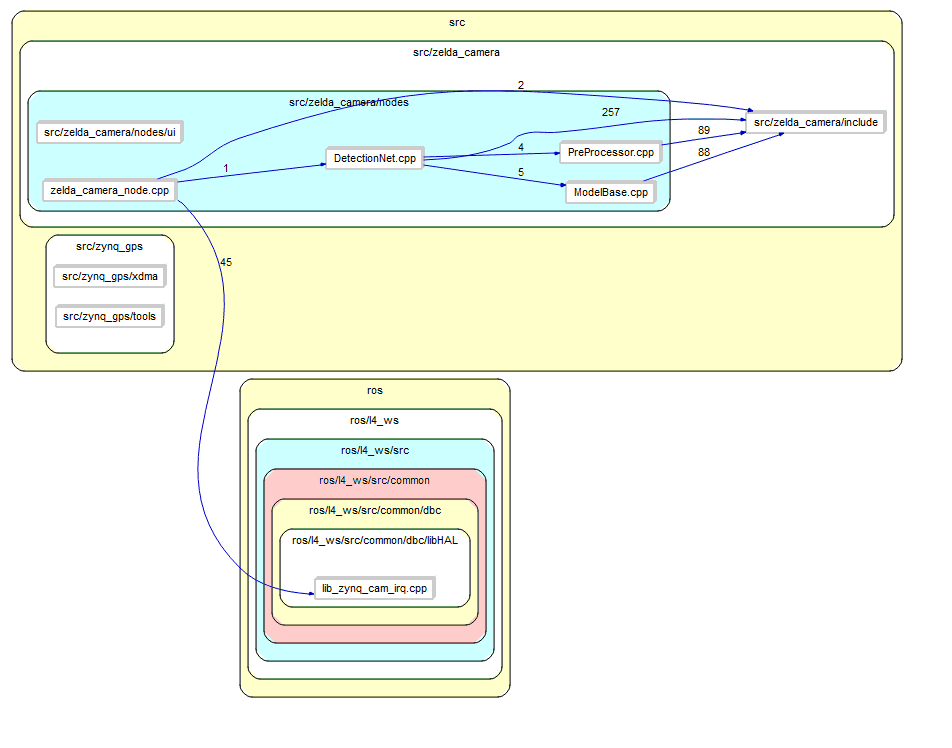
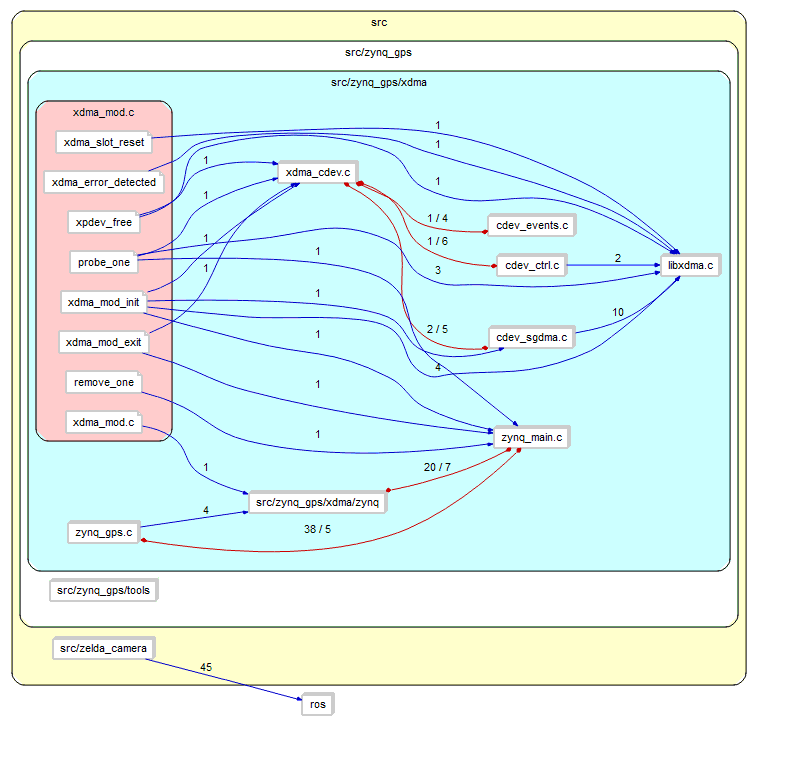
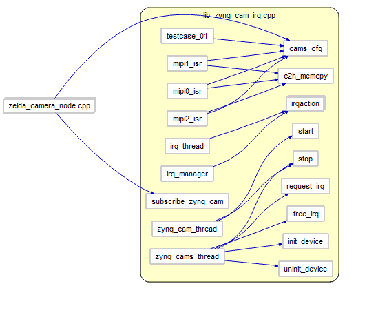

# kernel_xdma KMD
# Table of Contents

1.  [Overview of xdma KMD](#org14cad42)
    1.  [ZYNQ\_GPS](#org71d0106)
        1.  [ZYNQ\_GPS/XDMA](#org6c25103)
    2.  [ZYNQ\_GPS/tools](#org4e1330a)
        1.  [dma\_from\_device](#org025113f)
        2.  [reg\_rw](#org2bffe63)
        3.  [zynq\_rw](#orgdbff570)
    3.  [lib\_zynq](#orga02dc3c)
        1.  [FPGA PCIe Memory Address Map](#orgc3d3655)
        2.  [APIs](#org7370e13)
    4.  [Installation Guide](#org2f00b5b)
        1.  [How To Compile](#org96266a0)


<a id="org14cad42"></a>

# Overview of xdma KMD

-   xdma KMD provides memory-mapped PCIe address space for direct communication between CPU and FPGA
-   Linux userspace App would interface with the FPGA during runtime.

There are several parts required to work with FPGA: 


<table border="2" cellspacing="0" cellpadding="6" rules="groups" frame="hsides">


<colgroup>
<col  class="org-left" />

<col  class="org-left" />

<col  class="org-left" />
</colgroup>
<thead>
<tr>
<th scope="col" class="org-left">package</th>
<th scope="col" class="org-left">Description</th>
<th scope="col" class="org-left">Language</th>
</tr>
</thead>

<tbody>
<tr>
<td class="org-left">ZYNQ\_GPS</td>
<td class="org-left">Kernel Driver</td>
<td class="org-left">C</td>
</tr>


<tr>
<td class="org-left">ZYNQ\_GPS/tools</td>
<td class="org-left">Management Interface</td>
<td class="org-left">shell</td>
</tr>


<tr>
<td class="org-left">lib\_zynq</td>
<td class="org-left">User Library</td>
<td class="org-left">C++</td>
</tr>


<tr>
<td class="org-left">zelda\_camera</td>
<td class="org-left">App</td>
<td class="org-left">C++</td>
</tr>
</tbody>
</table>


<a id="org71d0106"></a>

## ZYNQ\_GPS

The ZYNQ\_GPS Driver is provided as an option to transfer data between the FPGA and the Instance&rsquo;s CPU memory.


<a id="org6c25103"></a>

### ZYNQ\_GPS/XDMA

ZYNQ\_GPS/XDMA is a Linux kernel driver for using DMA and User-defined interrupts for FPGA.
There are several parts required to work with: 


<table border="2" cellspacing="0" cellpadding="6" rules="groups" frame="hsides">


<colgroup>
<col  class="org-left" />

<col  class="org-left" />
</colgroup>
<thead>
<tr>
<th scope="col" class="org-left">models</th>
<th scope="col" class="org-left">Description</th>
</tr>
</thead>

<tbody>
<tr>
<td class="org-left">xdma\_mod</td>
<td class="org-left">kernel driver main</td>
</tr>


<tr>
<td class="org-left">libxdma</td>
<td class="org-left">Xilinx XDMA CORE</td>
</tr>


<tr>
<td class="org-left">zynq\_main</td>
<td class="org-left">NSU FPGA main</td>
</tr>


<tr>
<td class="org-left">zynq\_gps</td>
<td class="org-left">GPS time</td>
</tr>
</tbody>
</table>


<a id="org4e1330a"></a>

## ZYNQ\_GPS/tools

xdma KMD provides the following set of command-line tools for NSU management


<a id="org025113f"></a>

### dma\_from\_device


<a id="org2bffe63"></a>

### reg\_rw


<a id="orgdbff570"></a>

### zynq\_rw


<a id="orga02dc3c"></a>

## lib\_zynq




<a id="orgc3d3655"></a>

### FPGA PCIe Memory Address Map


<a id="org7370e13"></a>

### APIs

1.  Quick Example

    Before diving into the detail specification of the APIs, here&rsquo;s a short, intuitive example on how the developer could use it:
    The Program below uses [subscribe\_zynq\_cam()](#org7d97f90) to enable
    zynq\_camera\_callback() function that will get called when a new image has
    arrived.
    
        static void zynq_camera_callback(void *d)
        {
          zynq_cam_t         *cam    = (typeof(cam))d;
          memcpy(buf, ptr_of_cam(cam->id), size);
        }
        
        int main()
        {
          ret = subscribe_zynq_cam(cam_id, zynq_camera_callback);
        }

2.  subscribe\_zynq\_cam

        int subscribe_zynq_cam(int cam_id, void (*cb)(void *d))

3.  Messages


<a id="org2f00b5b"></a>

## Installation Guide

To make sure the driver is installed run next command from your linux shell:

    lsmod | grep xdma

Running this will return XDMA only if the driver is installed and running.


<a id="org96266a0"></a>

### How To Compile

Please follow the next set of steps:

1.  Clone the git repo locally:

        git clone

2.  Enter the directory and compile the code:

        cd kernel_xdma/xdma
        make
    
    If the \`make\` command was successful, you would find xdma.ko.

3.  Copy the driver to the modules directory:

        sudo make install
    
    To unload the driver:
    
        sudo rmmod xdma

# debug info
## ls /dev/xdma*
```bash
/dev/xdma0_c2h_0     /dev/xdma0_events_1   /dev/xdma0_events_12  /dev/xdma0_events_15  /dev/xdma0_events_4  /dev/xdma0_events_7  /dev/xdma0_h2c_0  /dev/xdma0_h2c_3
/dev/xdma0_control   /dev/xdma0_events_10  /dev/xdma0_events_13  /dev/xdma0_events_2   /dev/xdma0_events_5  /dev/xdma0_events_8  /dev/xdma0_h2c_1  /dev/xdma0_user
/dev/xdma0_events_0  /dev/xdma0_events_11  /dev/xdma0_events_14  /dev/xdma0_events_3   /dev/xdma0_events_6  /dev/xdma0_events_9  /dev/xdma0_h2c_2  /dev/xdma0_xvc

/dev/xdma:
card0
```

## kernel init
```bash
[   75.919383] xdma:xdma_mod_init: Xilinx XDMA Reference Driver xdma v2017.1.47
[   75.919386] xdma:xdma_mod_init: desc_blen_max: 0xfffffff/268435455, sgdma_timeout: 10 sec.
[   75.919478] xdma:xdma_device_open: xdma device 0000:02:00.0, 0x000000005472380b.
[   75.919480] xdma:alloc_dev_instance: xdev = 0x0000000020f78c83
[   75.925343] xdma:xdev_list_add: dev 0000:02:00.0, xdev 0x0000000020f78c83, xdma idx 0.
[   75.933288] xdma:request_regions: pci_request_regions()
[   75.938528] xdma:map_single_bar: BAR0: 524288 bytes to be mapped.
[   75.944646] xdma:map_single_bar: BAR0 at 0xfa800000 mapped at 0x00000000aec8bfbe, length=524288(/524288)
[   75.944649] xdma:is_config_bar: BAR 0 is NOT the XDMA config BAR: 0x0, 0x0.
[   75.951613] xdma:map_single_bar: BAR2: 65536 bytes to be mapped.
[   75.957633] xdma:map_single_bar: BAR2 at 0xfa880000 mapped at 0x00000000983959c2, length=65536(/65536)
[   75.957635] xdma:is_config_bar: BAR 2 is the XDMA config BAR
[   75.963295] xdma:map_bars: config bar 2, pos 1.
[   75.963299] xdma:identify_bars: xdev 0x0000000020f78c83, bars 2, config at 1.
[   75.970445] xdma:identify_bars: 2 BARs: config 1, user 0, bypass -1.
[   75.970446] xdma:set_dma_mask: sizeof(dma_addr_t) == 8
[   75.975588] xdma:set_dma_mask: pci_set_dma_mask()
[   75.980299] xdma:set_dma_mask: Using a 64-bit DMA mask.
[   75.985530] xdma:__write_register: channel_interrupts_disable: w reg 0x2000(0x0000000076220c9a), 0xffffffff.
[   75.995356] xdma:__write_register: user_interrupts_disable: w reg 0x2000(0x00000000d0e6b2e6), 0xffffffff.
[   76.004920] xdma:read_interrupts: ioread32(0x00000000200140d7) returned 0x00000000 (user_int_request).
[   76.004921] xdma:read_interrupts: ioread32(0x000000008e2e7d67) returned 0x00000000 (channel_int_request)
[   76.004924] xdma:probe_for_engine: found AXI H2C 0 engine, reg. off 0x0, id 0x1fc0,0x0.
[   76.004924] xdma:engine_init: channel 0, offset 0x0, dir 1.
[   76.004926] xdma:engine_init: engine 00000000b9239fc2 name 0-H2C0-MM irq_bitmask=0x00000001
[   76.004936] xdma:__write_register: engine_init_regs: w reg 0x27bb2fcc0bb4(0x00000000e9d4c8ec), 0x2000000.
[   76.004937] xdma:engine_alignments: engine 00000000b9239fc2 name 0-H2C0-MM alignments=0x00010140
[   76.004938] xdma:engine_alignments: align_bytes = 1
[   76.004938] xdma:engine_alignments: granularity_bytes = 1
[   76.004939] xdma:engine_alignments: address_bits = 64
[   76.004940] xdma:__write_register: engine_init_regs: w reg 0x27bb2fcc0c38(0x00000000dc964697), 0xf83e1e.
[   76.004944] xdma:probe_for_engine: found AXI H2C 1 engine, reg. off 0x100, id 0x1fc0,0x1.
[   76.004945] xdma:engine_init: channel 1, offset 0x100, dir 1.
[   76.004946] xdma:engine_init: engine 0000000090816c26 name 0-H2C1-MM irq_bitmask=0x00000002
[   76.004954] xdma:__write_register: engine_init_regs: w reg 0x27bb2fcc0b64(0x000000005080ece0), 0x2000000.
[   76.004956] xdma:engine_alignments: engine 0000000090816c26 name 0-H2C1-MM alignments=0x00010140
[   76.004956] xdma:engine_alignments: align_bytes = 1
[   76.004957] xdma:engine_alignments: granularity_bytes = 1
[   76.004957] xdma:engine_alignments: address_bits = 64
[   76.004958] xdma:__write_register: engine_init_regs: w reg 0x27bb2fcc0be8(0x00000000396e0c58), 0xf83e1e.
[   76.004960] xdma:probe_for_engine: found AXI H2C 2 engine, reg. off 0x200, id 0x1fc0,0x2.
[   76.004964] xdma:engine_init: channel 2, offset 0x200, dir 1.
[   76.004965] xdma:engine_init: engine 000000001c439546 name 0-H2C2-MM irq_bitmask=0x00000004
[   76.004973] xdma:__write_register: engine_init_regs: w reg 0x27bb2fcc0b14(0x0000000035c92ca5), 0x2000000.
[   76.004975] xdma:engine_alignments: engine 000000001c439546 name 0-H2C2-MM alignments=0x00010140
[   76.004975] xdma:engine_alignments: align_bytes = 1
[   76.004976] xdma:engine_alignments: granularity_bytes = 1
[   76.004976] xdma:engine_alignments: address_bits = 64
[   76.004977] xdma:__write_register: engine_init_regs: w reg 0x27bb2fcc0b98(0x00000000f1f5cb65), 0xf83e1e.
[   76.004979] xdma:probe_for_engine: found AXI H2C 3 engine, reg. off 0x300, id 0x1fc0,0x3.
[   76.004979] xdma:engine_init: channel 3, offset 0x300, dir 1.
[   76.004982] xdma:engine_init: engine 00000000eb4405f2 name 0-H2C3-MM irq_bitmask=0x00000008
[   76.004990] xdma:__write_register: engine_init_regs: w reg 0x27bb2fcc0ac4(0x000000009542c67d), 0x2000000.
[   76.004991] xdma:engine_alignments: engine 00000000eb4405f2 name 0-H2C3-MM alignments=0x00010140
[   76.004992] xdma:engine_alignments: align_bytes = 1
[   76.004992] xdma:engine_alignments: granularity_bytes = 1
[   76.004993] xdma:engine_alignments: address_bits = 64
[   76.004993] xdma:__write_register: engine_init_regs: w reg 0x27bb2fcc0b48(0x000000001b00f2c1), 0xf83e1e.
[   76.004996] xdma:probe_for_engine: found AXI C2H 0 engine, reg. off 0x1000, id 0x1fc1,0x0.
[   76.004996] xdma:engine_init: channel 0, offset 0x1000, dir 2.
[   76.004999] xdma:engine_init: engine 000000008db481df name 0-C2H0-MM irq_bitmask=0x00000010
[   76.005007] xdma:__write_register: engine_init_regs: w reg 0x27bb2fcc1674(0x0000000061ef96f6), 0x2000000.
[   76.005008] xdma:engine_alignments: engine 000000008db481df name 0-C2H0-MM alignments=0x00010140
[   76.005009] xdma:engine_alignments: align_bytes = 1
[   76.005009] xdma:engine_alignments: granularity_bytes = 1
[   76.005010] xdma:engine_alignments: address_bits = 64
[   76.005011] xdma:__write_register: engine_init_regs: w reg 0x27bb2fcc16f8(0x00000000b398edcb), 0xf83e1e.
[   76.005013] xdma:probe_for_engine: found AXI C2H 1 engine, reg. off 0x1100, id 0x1fc1,0x1.
[   76.005013] xdma:engine_init: channel 1, offset 0x1100, dir 2.
[   76.005015] xdma:engine_init: engine 00000000725f9120 name 0-C2H1-MM irq_bitmask=0x00000020
[   76.005024] xdma:__write_register: engine_init_regs: w reg 0x27bb2fcc1624(0x00000000bb2e2406), 0x2000000.
[   76.005025] xdma:engine_alignments: engine 00000000725f9120 name 0-C2H1-MM alignments=0x00010140
[   76.005025] xdma:engine_alignments: align_bytes = 1
[   76.005026] xdma:engine_alignments: granularity_bytes = 1
[   76.005026] xdma:engine_alignments: address_bits = 64
[   76.005027] xdma:__write_register: engine_init_regs: w reg 0x27bb2fcc16a8(0x0000000098c62164), 0xf83e1e.
[   76.005029] xdma:probe_for_engine: found AXI C2H 2 engine, reg. off 0x1200, id 0x1fc1,0x2.
[   76.005030] xdma:engine_init: channel 2, offset 0x1200, dir 2.
[   76.005031] xdma:engine_init: engine 00000000db162048 name 0-C2H2-MM irq_bitmask=0x00000040
[   76.005040] xdma:__write_register: engine_init_regs: w reg 0x27bb2fcc15d4(0x0000000092e68ca7), 0x2000000.
[   76.005041] xdma:engine_alignments: engine 00000000db162048 name 0-C2H2-MM alignments=0x00010140
[   76.005043] xdma:engine_alignments: align_bytes = 1
[   76.005044] xdma:engine_alignments: granularity_bytes = 1
[   76.005044] xdma:engine_alignments: address_bits = 64
[   76.005045] xdma:__write_register: engine_init_regs: w reg 0x27bb2fcc1658(0x000000000b81d300), 0xf83e1e.
[   76.005047] xdma:probe_for_engine: found AXI C2H 3 engine, reg. off 0x1300, id 0x1fc1,0x3.
[   76.005048] xdma:engine_init: channel 3, offset 0x1300, dir 2.
[   76.005049] xdma:engine_init: engine 00000000a9456fef name 0-C2H3-MM irq_bitmask=0x00000080
[   76.005059] xdma:__write_register: engine_init_regs: w reg 0x27bb2fcc1584(0x00000000bdb58cd5), 0x2000000.
[   76.005061] xdma:engine_alignments: engine 00000000a9456fef name 0-C2H3-MM alignments=0x00010140
[   76.005061] xdma:engine_alignments: align_bytes = 1
[   76.005061] xdma:engine_alignments: granularity_bytes = 1
[   76.005062] xdma:engine_alignments: address_bits = 64
[   76.005063] xdma:__write_register: engine_init_regs: w reg 0x27bb2fcc1608(0x000000002ced3d58), 0xf83e1e.
[   76.005067] xdma:enable_msi_msix: Enabling MSI-X
[   76.005306] xdma:pci_keep_intx_enabled: 0000:02:00.0: clear INTX_DISABLE, 0x507 -> 0x107.
[   76.005320] xdma:irq_msix_channel_setup: engine 0-H2C0-MM, irq#47.
[   76.005330] xdma:irq_msix_channel_setup: engine 0-H2C1-MM, irq#49.
[   76.005338] xdma:irq_msix_channel_setup: engine 0-H2C2-MM, irq#50.
[   76.005345] xdma:irq_msix_channel_setup: engine 0-H2C3-MM, irq#51.
[   76.005353] xdma:irq_msix_channel_setup: engine 0-C2H0-MM, irq#52.
[   76.005360] xdma:irq_msix_channel_setup: engine 0-C2H1-MM, irq#53.
[   76.005367] xdma:irq_msix_channel_setup: engine 0-C2H2-MM, irq#54.
[   76.005374] xdma:irq_msix_channel_setup: engine 0-C2H3-MM, irq#55.
[   76.005383] xdma:irq_msix_user_setup: 0-USR-0, IRQ#56 with 0x0000000096d51e2b
[   76.005391] xdma:irq_msix_user_setup: 0-USR-1, IRQ#57 with 0x000000001ae546c3
[   76.005398] xdma:irq_msix_user_setup: 0-USR-2, IRQ#58 with 0x000000004ad88c35
[   76.005406] xdma:irq_msix_user_setup: 0-USR-3, IRQ#59 with 0x000000004c7011dc
[   76.005413] xdma:irq_msix_user_setup: 0-USR-4, IRQ#60 with 0x00000000d8343c01
[   76.005420] xdma:irq_msix_user_setup: 0-USR-5, IRQ#61 with 0x00000000b9e307de
[   76.005428] xdma:irq_msix_user_setup: 0-USR-6, IRQ#62 with 0x0000000029a8a79d
[   76.005434] xdma:irq_msix_user_setup: 0-USR-7, IRQ#63 with 0x00000000bd96df36
[   76.005442] xdma:irq_msix_user_setup: 0-USR-8, IRQ#64 with 0x00000000dfda7810
[   76.005450] xdma:irq_msix_user_setup: 0-USR-9, IRQ#65 with 0x0000000083e33b61
[   76.005457] xdma:irq_msix_user_setup: 0-USR-10, IRQ#66 with 0x0000000006c5c324
[   76.005464] xdma:irq_msix_user_setup: 0-USR-11, IRQ#67 with 0x00000000ec61b684
[   76.005472] xdma:irq_msix_user_setup: 0-USR-12, IRQ#68 with 0x00000000f19e48c1
[   76.005479] xdma:irq_msix_user_setup: 0-USR-13, IRQ#69 with 0x000000004dfe5788
[   76.005486] xdma:irq_msix_user_setup: 0-USR-14, IRQ#70 with 0x00000000caae7fbf
[   76.005493] xdma:irq_msix_user_setup: 0-USR-15, IRQ#71 with 0x00000000ef08a225
[   76.005495] xdma:__write_register: prog_irq_msix_channel: w reg 0x20a0(0x000000002032c9da), 0x3020100.
[   76.005497] xdma:prog_irq_msix_channel: vector 0, 0x3020100.
[   76.005498] xdma:__write_register: prog_irq_msix_channel: w reg 0x20a4(0x00000000ec14110c), 0x7060504.
[   76.005499] xdma:prog_irq_msix_channel: vector 1, 0x7060504.
[   76.005500] xdma:__write_register: prog_irq_msix_user: w reg 0x2080(0x000000000cb087d4), 0xb0a0908.
[   76.005501] xdma:prog_irq_msix_user: vector 0, 0xb0a0908.
[   76.005502] xdma:__write_register: prog_irq_msix_user: w reg 0x2084(0x000000005dfdd7df), 0xf0e0d0c.
[   76.005502] xdma:prog_irq_msix_user: vector 1, 0xf0e0d0c.
[   76.005503] xdma:__write_register: prog_irq_msix_user: w reg 0x2088(0x000000009ca16a90), 0x13121110.
[   76.005504] xdma:prog_irq_msix_user: vector 2, 0x13121110.
[   76.005506] xdma:__write_register: prog_irq_msix_user: w reg 0x208c(0x000000005a367e3e), 0x17161514.
[   76.005507] xdma:prog_irq_msix_user: vector 3, 0x17161514.
[   76.005508] xdma:__write_register: channel_interrupts_enable: w reg 0x2000(0x000000004cb7ab50), 0xffffffff.
[   76.005509] xdma:read_interrupts: ioread32(0x00000000200140d7) returned 0x00000000 (user_int_request).
[   76.005510] xdma:read_interrupts: ioread32(0x000000008e2e7d67) returned 0x00000000 (channel_int_request)
[   76.005512] xdma:__write_register: user_interrupts_enable: w reg 0x2000(0x00000000df1d61c3), 0x1ffff.
[   76.005513] xdma:read_interrupts: ioread32(0x00000000200140d7) returned 0x00000000 (user_int_request).
[   76.005516] xdma:read_interrupts: ioread32(0x000000008e2e7d67) returned 0x00000000 (channel_int_request)
[   76.005518] xdma:probe_one: 0000:02:00.0 xdma0, pdev 0x000000005472380b, xdev 0x00000000ef3090ac, 0x0000000020f78c83, usr 16, ch 4,4.
[   76.005521] xdma:create_xcdev: xcdev 0x000000007c878022, 237:1, (null), type 0x1.
[   76.005610] xdma:create_xcdev: xcdev 0x0000000049ac4b1c, 237:10, (null), type 0x3.
[   76.005639] xdma:create_xcdev: xcdev 0x00000000d62b793c, 237:11, (null), type 0x3.
[   76.005665] xdma:create_xcdev: xcdev 0x00000000a66056b6, 237:12, (null), type 0x3.
[   76.005690] xdma:create_xcdev: xcdev 0x00000000d95d9d4a, 237:13, (null), type 0x3.
[   76.005715] xdma:create_xcdev: xcdev 0x000000003921f07b, 237:14, (null), type 0x3.
[   76.005741] xdma:create_xcdev: xcdev 0x00000000350dadff, 237:15, (null), type 0x3.
[   76.005767] xdma:create_xcdev: xcdev 0x00000000b8d36962, 237:16, (null), type 0x3.
[   76.005793] xdma:create_xcdev: xcdev 0x000000007602bb78, 237:17, (null), type 0x3.
[   76.005817] xdma:create_xcdev: xcdev 0x0000000051a00f7a, 237:18, (null), type 0x3.
[   76.005843] xdma:create_xcdev: xcdev 0x00000000cb3a9a20, 237:19, (null), type 0x3.
[   76.005869] xdma:create_xcdev: xcdev 0x00000000f2e6ba60, 237:20, (null), type 0x3.
[   76.005894] xdma:create_xcdev: xcdev 0x00000000dfe511a3, 237:21, (null), type 0x3.
[   76.005919] xdma:create_xcdev: xcdev 0x00000000f959bb8f, 237:22, (null), type 0x3.
[   76.005945] xdma:create_xcdev: xcdev 0x00000000236e77c8, 237:23, (null), type 0x3.
[   76.005970] xdma:create_xcdev: xcdev 0x00000000c012baa8, 237:24, (null), type 0x3.
[   76.005995] xdma:create_xcdev: xcdev 0x000000001f9865a5, 237:25, (null), type 0x3.
[   76.006020] xdma:create_xcdev: xcdev 0x00000000e8071076, 237:32, (null), type 0x4.
[   76.006045] xdma:create_xcdev: xcdev 0x0000000077cd4631, 237:33, (null), type 0x4.
[   76.006070] xdma:create_xcdev: xcdev 0x00000000d7e565e3, 237:34, (null), type 0x4.
[   76.006094] xdma:create_xcdev: xcdev 0x000000009c653d43, 237:35, (null), type 0x4.
[   76.006120] xdma:create_xcdev: xcdev 0x00000000b6707a55, 237:36, (null), type 0x5.
[   76.006146] xdma:create_xcdev: xcdev 0x00000000a7b9527f, 237:37, (null), type 0x5.
[   76.006171] xdma:create_xcdev: xcdev 0x00000000bba24837, 237:38, (null), type 0x5.
[   76.006205] xdma:create_xcdev: xcdev 0x00000000760d4b01, 237:39, (null), type 0x5.
[   76.006236] xdma:create_xcdev: xcdev 0x00000000f55a127c, 237:0, (null), type 0x0.
[   76.006263] xdma:cdev_xvc_init: xcdev 0x000000003b94501d, bar 0, offset 0x40000.
[   76.006265] xdma:create_xcdev: xcdev 0x000000003b94501d, 237:2, (null), type 0x2.
[   76.006289] basa: zynq_zdev_init: chan_cnt = 16, video_cnt = 5, can_cnt = 4
[   76.006293] basa: 0 zdev_alloc ch0 video0
[   76.006294] basa: 0 zdev_alloc ch1 video1
[   76.006294] basa: 0 zdev_alloc ch2 video2
[   76.006295] basa: 0 zdev_alloc ch3 video3
[   76.006295] basa: 0 zdev_alloc ch4 video4
[   76.006296] basa: 0 zdev_alloc ch10 can0
[   76.006297] basa: 0 zdev_alloc ch11 can1
[   76.006297] basa: 0 zdev_alloc ch12 can2
[   76.006298] basa: 0 zdev_alloc ch13 can3
[   76.006342] basa: zynq_probe map bar0: bar_start=0xfa800000, bar_len=524288, bar_va=0x00000000272c88d2
[   76.006344] basa: 0 zynq_g_reg_read: g_reg 0x0 = 0xad010000
[   76.006346] basa: FPGA device <10ee,903f> basa0--0000-02-00-0
[   76.006376] basa: zynq_create_cdev created device /dev/kernel_xdma0
[   76.006379] basa: 0 zynq_g_reg_write: write 0xffffffff to g_reg 0x108
[   76.006380] basa: 0 zynq_g_reg_write: write 0xffffffff to g_reg 0x118
[   76.006381] basa: 0 zynq_g_reg_write: write 0xffffffef to g_reg 0x124
[   76.006381] basa: 0 kernel_xdma_init: GPS master device set
[   76.006383] basa: 0 zynq_g_reg_read: g_reg 0x8 = 0xa15
[   76.006383] basa: 0 PPS is OFF, GPS is NOT locked
[   76.006423] basa:  found, device basa0--0000-02-00-0, firmware version=ad010000.
[   76.006426] basa: 0 zynq_g_reg_read: g_reg 0x2040 = 0x0
[   76.006429] basa: 0 zynq_get_gps_time: GPS time is not valid
[   86.236448] basa: 0 zynq_g_reg_read: g_reg 0x2040 = 0x0
```

## test 
```bash
./run_test.sh
Info: Number of enabled h2c channels = 1
Read 32-bit value at address 0x00001000 (0x7f95e5377000): 0x1fc10006
Read 32-bit value at address 0x00001100 (0x7f350adc6100): 0x1fc10106
Read 32-bit value at address 0x00001200 (0x777dda7200): 0x1fc10206
Read 32-bit value at address 0x00001300 (0x7f5f74e21300): 0x1fc10306
Info: Number of enabled c2h channels = 4
Info: The PCIe DMA core is memory mapped.
Info: Running PCIe DMA memory mapped write read test
      transfer size:  1024
      transfer count: 1
Info: Writing to h2c channel 0 at address offset 0.
Info: Wait for current transactions to complete.
/dev/xdma0_h2c_0, W off 0x0, 0x0 != 0x400.
write file: Success
Info: Writing to h2c channel 0 at address offset 1024.
Info: Wait for current transactions to complete.
/dev/xdma0_h2c_0, W off 0x400, 0x0 != 0x400.
write file: Success
Info: Writing to h2c channel 0 at address offset 2048.
Info: Wait for current transactions to complete.
/dev/xdma0_h2c_0, W off 0x800, 0x0 != 0x400.
write file: Success
Info: Writing to h2c channel 0 at address offset 3072.
Info: Wait for current transactions to complete.
/dev/xdma0_h2c_0, W off 0xc00, 0x0 != 0x400.
write file: Success
Info: Reading from c2h channel 0 at address offset 0.
/dev/xdma0_c2h_0, R off 0x0, 0x0 != 0x400.
read file: Success
Info: Reading from c2h channel 1 at address offset 1024.
Info: Reading from c2h channel 2 at address offset 2048.
/dev/xdma0_c2h_1, R off 0x0, 0x0 != 0x400.
read file: Success
/dev/xdma0_c2h_2, R off 0x0, 0x0 != 0x400.
read file: Success
Info: Reading from c2h channel 3 at address offset 3072.
Info: Wait for the current transactions to complete.
/dev/xdma0_c2h_3, R off 0x0, 0x0 != 0x400.
read file: Success
Info: Checking data integrity.
cmp: EOF on data/output_datafile0_4K.bin
Error: The data written did not match the data that was read.
       address range:   0 - 1024
       write data file: data/datafile0_4K.bin
       read data file:  data/output_datafile0_4K.bin
cmp: EOF on data/output_datafile1_4K.bin
Error: The data written did not match the data that was read.
       address range:   1024 - 2048
       write data file: data/datafile1_4K.bin
       read data file:  data/output_datafile1_4K.bin
cmp: EOF on data/output_datafile2_4K.bin
Error: The data written did not match the data that was read.
       address range:   2048 - 3072
       write data file: data/datafile2_4K.bin
       read data file:  data/output_datafile2_4K.bin
cmp: EOF on data/output_datafile3_4K.bin
Error: The data written did not match the data that was read.
       address range:   3072 - 4096
       write data file: data/datafile3_4K.bin
       read data file:  data/output_datafile3_4K.bin
Error: Test completed with Errors.
Error: Test completed with Errors.
```

### kernel 
```bash
[ 1249.989282] xdma:bridge_mmap: mmap(): xcdev = 0xffff95528b580038
[ 1249.995311] xdma:bridge_mmap: mmap(): xcdev->bar  = 2
[ 1250.000403] xdma:bridge_mmap: mmap(): xcdev->xdev = 0x000000006c147a3b
[ 1250.006955] xdma:bridge_mmap: mmap(): xcdev->xdev->pdev = 0xffff95529ab87000
[ 1250.014018] xdma:bridge_mmap: [phys:0xfa900000] = [start:0xfa900000] + [off:0x0]
[ 1250.021433] xdma:bridge_mmap: vma=0x00000000a4b49c3d, vma->vm_start=0x7f4f00061000, pt:phys=0xfa900, size=32768 = 0
[ 1250.034411] xdma:bridge_mmap: mmap(): xcdev = 0xffff95528b580038
[ 1250.040430] xdma:bridge_mmap: mmap(): xcdev->bar  = 2
[ 1250.045492] xdma:bridge_mmap: mmap(): xcdev->xdev = 0x000000006c147a3b
[ 1250.052028] xdma:bridge_mmap: mmap(): xcdev->xdev->pdev = 0xffff95529ab87000
[ 1250.059090] xdma:bridge_mmap: [phys:0xfa900000] = [start:0xfa900000] + [off:0x0]
[ 1250.066554] xdma:bridge_mmap: vma=0x000000005dd782c5, vma->vm_start=0x7f9e34ecf000, pt:phys=0xfa900, size=32768 = 0
[ 1250.079182] xdma:bridge_mmap: mmap(): xcdev = 0xffff95528b580038
[ 1250.085190] xdma:bridge_mmap: mmap(): xcdev->bar  = 2
[ 1250.090262] xdma:bridge_mmap: mmap(): xcdev->xdev = 0x000000006c147a3b
[ 1250.096795] xdma:bridge_mmap: mmap(): xcdev->xdev->pdev = 0xffff95529ab87000
[ 1250.103839] xdma:bridge_mmap: [phys:0xfa900000] = [start:0xfa900000] + [off:0x0]
[ 1250.111240] xdma:bridge_mmap: vma=0x00000000724839, vma->vm_start=0x7f0919e12000, pt:phys=0xfa900, size=32768 = 0
[ 1250.123546] xdma:bridge_mmap: mmap(): xcdev = 0xffff95528b580038
[ 1250.129559] xdma:bridge_mmap: mmap(): xcdev->bar  = 2
[ 1250.134617] xdma:bridge_mmap: mmap(): xcdev->xdev = 0x000000006c147a3b
[ 1250.141141] xdma:bridge_mmap: mmap(): xcdev->xdev->pdev = 0xffff95529ab87000
[ 1250.148187] xdma:bridge_mmap: [phys:0xfa900000] = [start:0xfa900000] + [off:0x0]
[ 1250.155637] xdma:bridge_mmap: vma=0x0000000027f6e948, vma->vm_start=0x7f619eb92000, pt:phys=0xfa900, size=32768 = 0
[ 1250.168172] xdma:bridge_mmap: mmap(): xcdev = 0xffff95528b580038
[ 1250.174195] xdma:bridge_mmap: mmap(): xcdev->bar  = 2
[ 1250.179260] xdma:bridge_mmap: mmap(): xcdev->xdev = 0x000000006c147a3b
[ 1250.185794] xdma:bridge_mmap: mmap(): xcdev->xdev->pdev = 0xffff95529ab87000
[ 1250.192838] xdma:bridge_mmap: [phys:0xfa900000] = [start:0xfa900000] + [off:0x0]
[ 1250.200233] xdma:bridge_mmap: vma=0x0000000022b0708d, vma->vm_start=0x7cfa7c7000, pt:phys=0xfa900, size=32768 = 0
[ 1250.211797] xdma:bridge_mmap: mmap(): xcdev = 0xffff95528b580038
[ 1250.217808] xdma:bridge_mmap: mmap(): xcdev->bar  = 2
[ 1250.222861] xdma:bridge_mmap: mmap(): xcdev->xdev = 0x000000006c147a3b
[ 1250.229387] xdma:bridge_mmap: mmap(): xcdev->xdev->pdev = 0xffff95529ab87000
[ 1250.236433] xdma:bridge_mmap: [phys:0xfa900000] = [start:0xfa900000] + [off:0x0]
[ 1250.243826] xdma:bridge_mmap: vma=0x00000000f58cbc6e, vma->vm_start=0x7fe6be0f8000, pt:phys=0xfa900, size=32768 = 0
[ 1250.255472] xdma:bridge_mmap: mmap(): xcdev = 0xffff95528b580038
[ 1250.261487] xdma:bridge_mmap: mmap(): xcdev->bar  = 2
[ 1250.266542] xdma:bridge_mmap: mmap(): xcdev->xdev = 0x000000006c147a3b
[ 1250.273086] xdma:bridge_mmap: mmap(): xcdev->xdev->pdev = 0xffff95529ab87000
[ 1250.280142] xdma:bridge_mmap: [phys:0xfa900000] = [start:0xfa900000] + [off:0x0]
[ 1250.287542] xdma:bridge_mmap: vma=0x000000000d7ed50e, vma->vm_start=0x7f157391e000, pt:phys=0xfa900, size=32768 = 0
[ 1250.299212] xdma:bridge_mmap: mmap(): xcdev = 0xffff95528b580038
[ 1250.305223] xdma:bridge_mmap: mmap(): xcdev->bar  = 2
[ 1250.310282] xdma:bridge_mmap: mmap(): xcdev->xdev = 0x000000006c147a3b
[ 1250.316807] xdma:bridge_mmap: mmap(): xcdev->xdev->pdev = 0xffff95529ab87000
[ 1250.323850] xdma:bridge_mmap: [phys:0xfa900000] = [start:0xfa900000] + [off:0x0]
[ 1250.331258] xdma:bridge_mmap: vma=0x00000000e4aad0c0, vma->vm_start=0x7feb8e2fc000, pt:phys=0xfa900, size=32768 = 0
[ 1250.344859] xdma:char_sgdma_read_write: file 0x00000000dcc6f80f, priv 0x00000000dc96f226, buf 0x0000000040f48d23,1024, pos 0, W 1, 0-H2C0-MM.
[ 1250.357574] xdma:xdma_request_cb_dump: request 0x00000000263688ca, total 1024, ep 0x0, sw_desc 0, sgt 0x000000002a3ec1.
[ 1250.357577] xdma:sgt_dump: sgt 0x000000002a3ec1, sgl 0x000000000f93932d, nents 1/1.
[ 1250.357579] xdma:sgt_dump: 0, 0x000000000f93932d, pg 0x0000000081606eb5,0+1024, dma 0x7eeed5000,1024.
[ 1250.357581] xdma:xdma_xfer_submit: 0-H2C0-MM, len 1024 sg cnt 0.
[ 1250.364390] xdma:char_sgdma_llseek: char_sgdma_llseek: pos=1024
[ 1250.370324] xdma:char_sgdma_read_write: file 0x00000000a72851d2, priv 0x00000000dc96f226, buf 0x000000009b106c2f,1024, pos 1024, W 1, 0-H2C0-MM.
[ 1250.383270] xdma:xdma_request_cb_dump: request 0x00000000263688ca, total 1024, ep 0x400, sw_desc 0, sgt 0x000000007198b6a8.
[ 1250.383271] xdma:sgt_dump: sgt 0x000000007198b6a8, sgl 0x0000000001eae5f5, nents 1/1.
[ 1250.383273] xdma:sgt_dump: 0, 0x0000000001eae5f5, pg 0x00000000fbe10faa,0+1024, dma 0x7f0763000,1024.
[ 1250.383273] xdma:xdma_xfer_submit: 0-H2C0-MM, len 1024 sg cnt 0.
[ 1250.384072] xdma:char_sgdma_llseek: char_sgdma_llseek: pos=2048
[ 1250.384075] xdma:char_sgdma_read_write: file 0x00000000e8c939d9, priv 0x00000000dc96f226, buf 0x00000000bc922832,1024, pos 2048, W 1, 0-H2C0-MM.
[ 1250.384078] xdma:xdma_request_cb_dump: request 0x00000000263688ca, total 1024, ep 0x800, sw_desc 0, sgt 0x00000000adfb63b4.
[ 1250.384079] xdma:sgt_dump: sgt 0x00000000adfb63b4, sgl 0x00000000e6e05ac3, nents 1/1.
[ 1250.384080] xdma:sgt_dump: 0, 0x00000000e6e05ac3, pg 0x00000000ff90515d,0+1024, dma 0x7ed721000,1024.
[ 1250.384081] xdma:xdma_xfer_submit: 0-H2C0-MM, len 1024 sg cnt 0.
[ 1250.384896] xdma:char_sgdma_llseek: char_sgdma_llseek: pos=3072
[ 1250.384900] xdma:char_sgdma_read_write: file 0x00000000fc2c2156, priv 0x00000000dc96f226, buf 0x000000001c17cbc1,1024, pos 3072, W 1, 0-H2C0-MM.
[ 1250.384902] xdma:xdma_request_cb_dump: request 0x00000000263688ca, total 1024, ep 0xc00, sw_desc 0, sgt 0x0000000033216cbf.
[ 1250.384903] xdma:sgt_dump: sgt 0x0000000033216cbf, sgl 0x00000000a29d0d97, nents 1/1.
[ 1250.384905] xdma:sgt_dump: 0, 0x00000000a29d0d97, pg 0x00000000f62576d7,0+1024, dma 0x811d9d000,1024.
[ 1250.384905] xdma:xdma_xfer_submit: 0-H2C0-MM, len 1024 sg cnt 0.
[ 1250.386770] xdma:char_sgdma_read_write: file 0x0000000058929931, priv 0x00000000efa07e1f, buf 0x00000000079a984b,1024, pos 0, W 0, 0-C2H0-MM.
[ 1250.386774] xdma:xdma_request_cb_dump: request 0x00000000263688ca, total 1024, ep 0x0, sw_desc 0, sgt 0x000000005cde348a.
[ 1250.386775] xdma:sgt_dump: sgt 0x000000005cde348a, sgl 0x000000001cf7cbc2, nents 1/1.
[ 1250.386777] xdma:sgt_dump: 0, 0x000000001cf7cbc2, pg 0x00000000f15c6a67,0+1024, dma 0x7ed741000,1024.
[ 1250.386778] xdma:xdma_xfer_submit: 0-C2H0-MM, len 1024 sg cnt 0.
[ 1250.388577] xdma:char_sgdma_llseek: char_sgdma_llseek: pos=1024
[ 1250.388580] xdma:char_sgdma_read_write: file 0x000000001ebaff42, priv 0x0000000045e66ae0, buf 0x00000000dcd21bdf,1024, pos 1024, W 0, 0-C2H1-MM.
[ 1250.388584] xdma:xdma_request_cb_dump: request 0x00000000263688ca, total 1024, ep 0x400, sw_desc 0, sgt 0x000000002dfab071.
[ 1250.388585] xdma:sgt_dump: sgt 0x000000002dfab071, sgl 0x00000000956678d6, nents 1/1.
[ 1250.388587] xdma:sgt_dump: 0, 0x00000000956678d6, pg 0x0000000009f24413,0+1024, dma 0x811379000,1024.
[ 1250.388587] xdma:xdma_xfer_submit: 0-C2H1-MM, len 1024 sg cnt 0.
[ 1250.390204] xdma:char_sgdma_llseek: char_sgdma_llseek: pos=2048
[ 1250.390208] xdma:char_sgdma_read_write: file 0x00000000445bae02, priv 0x0000000089302311, buf 0x000000003118af79,1024, pos 2048, W 0, 0-C2H2-MM.
[ 1250.390212] xdma:xdma_request_cb_dump: request 0x00000000263688ca, total 1024, ep 0x800, sw_desc 0, sgt 0x0000000089964699.
[ 1250.390213] xdma:sgt_dump: sgt 0x0000000089964699, sgl 0x0000000078e4c9fa, nents 1/1.
[ 1250.390214] xdma:sgt_dump: 0, 0x0000000078e4c9fa, pg 0x00000000ce55d5,0+1024, dma 0x7ed746000,1024.
[ 1250.390215] xdma:xdma_xfer_submit: 0-C2H2-MM, len 1024 sg cnt 0.
[ 1250.391794] xdma:char_sgdma_llseek: char_sgdma_llseek: pos=3072
[ 1250.391797] xdma:char_sgdma_read_write: file 0x00000000f2a18c13, priv 0x00000000e7015a18, buf 0x00000000c9e5242e,1024, pos 3072, W 0, 0-C2H3-MM.
[ 1250.391801] xdma:xdma_request_cb_dump: request 0x00000000263688ca, total 1024, ep 0xc00, sw_desc 0, sgt 0x000000001ce6a56d.
[ 1250.391802] xdma:sgt_dump: sgt 0x000000001ce6a56d, sgl 0x00000000eae9d72b, nents 1/1.
[ 1250.391804] xdma:sgt_dump: 0, 0x00000000eae9d72b, pg 0x0000000068d45ac5,0+1024, dma 0x7f3170000,1024.
[ 1250.391805] xdma:xdma_xfer_submit: 0-C2H3-MM, len 1024 sg cnt 0.
```
## c2h tests
### usr
```bash
   ./dma_from_device -d /dev/xdma0_c2h_0 -f ../tests/data/output_datafile2_4K.bin -s 1024 -a 0x5000000000 -c 1
```
### kernel
```bash
[ 4533.435099] xdma:char_sgdma_llseek: char_sgdma_llseek: pos=343597383680
[ 4533.441733] xdma:char_sgdma_read_write: file 0x0000000010487e4e, priv 0x000000005fed571c, buf 0x000000002b060770,1024, pos 343597383680, W 0, 0-C2H0-MM.
[ 4533.455434] xdma:xdma_request_cb_dump: request 0x000000005c8b4e5d, total 1024, ep 0x5000000000, sw_desc 1, sgt 0x00000000a8652ba2.
[ 4533.455437] xdma:sgt_dump: sgt 0x00000000a8652ba2, sgl 0x00000000f5ae718e, nents 1/1.
[ 4533.455439] xdma:sgt_dump: 0, 0x00000000f5ae718e, pg 0x00000000cd45e8cb,0+1024, dma 0x7fbb01000,1024.
[ 4533.455441] xdma:xdma_request_cb_dump: 0/1, 0x7fbb01000, 1024.
[ 4533.455447] xdma:xdma_xfer_submit: 0-C2H0-MM, len 1024 sg cnt 1.
[ 4533.455454] xdma:transfer_init: transfer->desc_bus = 0x33c60000.
[ 4533.455462] xdma:transfer_build: sw desc 0/1: 0x7fbb01000, 0x400, ep 0x5000000000.
[ 4533.455466] xdma:transfer_init: transfer 0x000000005c9940d6 has 1 descriptors
[ 4533.455470] xdma:xdma_xfer_submit: xfer, 1024, ep 0x5000000400, done 0, sg 1/1.
[ 4533.455474] xdma:transfer_dump: xfer 0x000000005c9940d6, state 0x0, f 0x1, dir 2, len 1024, last 1.
[ 4533.455480] xdma:transfer_dump: transfer 0x000000005c9940d6, desc 1, bus 0x33c60000, adj 1.
[ 4533.455485] xdma:dump_desc: 0xffff8e4db3c60000/0x00: 0xad4b0013 0xad4b0013 magic|extra_adjacent|control
[ 4533.455489] xdma:dump_desc: 0xffff8e4db3c60004/0x04: 0x00000400 0x00000400 bytes
[ 4533.455496] xdma:dump_desc: 0xffff8e4db3c60008/0x08: 0x00000000 0x00000000 src_addr_lo
[ 4533.455500] xdma:dump_desc: 0xffff8e4db3c6000c/0x0c: 0x00000050 0x00000050 src_addr_hi
[ 4533.455504] xdma:dump_desc: 0xffff8e4db3c60010/0x00: 0xfbb01000 0xfbb01000 dst_addr_lo
[ 4533.455509] xdma:dump_desc: 0xffff8e4db3c60014/0x04: 0x00000007 0x00000007 dst_addr_hi
[ 4533.455513] xdma:dump_desc: 0xffff8e4db3c60018/0x08: 0x00000000 0x00000000 next_addr
[ 4533.455520] xdma:dump_desc: 0xffff8e4db3c6001c/0x0c: 0x00000000 0x00000000 next_addr_pad
[ 4533.455521] xdma:dump_desc: 
[ 4533.455522] xdma:transfer_queue: transfer_queue(transfer=0x000000005c9940d6).
[ 4533.455524] xdma:transfer_queue: transfer_queue(): starting 0-C2H0-MM engine.
[ 4533.455525] xdma:engine_start: engine_start(0-C2H0-MM): transfer=0x000000005c9940d6.
[ 4533.455527] xdma:engine_start: iowrite32(0x33c60000 to 0x0000000038c072e5) (first_desc_lo)
[ 4533.455529] xdma:__write_register: engine_start: w reg 0x185c70c906e0(0x0000000038c072e5), 0x33c60000.
[ 4533.455531] xdma:engine_start: iowrite32(0x00000000 to 0x0000000033c98cb2) (first_desc_hi)
[ 4533.455532] xdma:__write_register: engine_start: w reg 0x185c70c906e4(0x0000000033c98cb2), 0x0.
[ 4533.455534] xdma:engine_start: iowrite32(0x00000000 to 0x00000000fc49806e) (first_desc_adjacent)
[ 4533.455538] xdma:__write_register: engine_start: w reg 0x185c70c906e8(0x00000000fc49806e), 0x0.
[ 4533.455542] xdma:engine_start: ioread32(0x00000000d7abf21e) (dummy read flushes writes).
[ 4533.455546] xdma:engine_start_mode_config: iowrite32(0x00f83e1f to 0x0000000078866d8c) (control)
[ 4533.455551] xdma:__write_register: engine_start_mode_config: w reg 0x185c70c8c66c(0x0000000078866d8c), 0xf83e1f.
[ 4533.455557] xdma:engine_start_mode_config: ioread32(0x00000000d7abf21e) = 0x00000001 (dummy read flushes writes).
[ 4533.455563] xdma:xdma_channel_irq: (irq=54) <<<< INTERRUPT service ROUTINE
[ 4533.455564] xdma:engine_start: 0-C2H0-MM engine 0x0000000003df0b87 now running
[ 4533.455571] xdma:__write_register: xdma_channel_irq: w reg 0x185c70c8c700(0x0000000038810f59), 0xf83e1e.
[ 4533.455573] xdma:transfer_queue: transfer=0x000000005c9940d6 started 0-C2H0-MM engine with transfer 0x000000005c9940d6.
[ 4533.455578] xdma:transfer_queue: engine->running = 1
[ 4533.455583] xdma:engine_service_work: engine_service() for 0-C2H0-MM engine 0000000003df0b87
[ 4533.455587] xdma:engine_service_shutdown: engine just went idle, resetting RUN_STOP.
[ 4533.455593] xdma:xdma_engine_stop: xdma_engine_stop(engine=0000000003df0b87)
[ 4533.455598] xdma:xdma_engine_stop: Stopping SG DMA 0-C2H0-MM engine; writing 0x00f83e1e to 0x0000000078866d8c.
[ 4533.455603] xdma:__write_register: xdma_engine_stop: w reg 0x185c70c8c66c(0x0000000078866d8c), 0xf83e1e.
[ 4533.455607] xdma:xdma_engine_stop: xdma_engine_stop(0-C2H0-MM) done
[ 4533.455613] xdma:engine_service: desc_count = 1
[ 4533.455618] xdma:engine_service: head of queue transfer 0x000000005c9940d6 has 1 descriptors
[ 4533.455622] xdma:engine_service: Engine completed 1 desc, 1 not yet dequeued
[ 4533.455628] xdma:engine_service_final_transfer: engine 0-C2H0-MM completed transfer
[ 4533.455632] xdma:engine_service_final_transfer: Completed transfer ID = 0x000000005c9940d6
[ 4533.455638] xdma:engine_service_final_transfer: *pdesc_completed=1, transfer->desc_num=1
[ 4533.455647] xdma:engine_service_resume: no pending transfers, 0-C2H0-MM engine stays idle.
[ 4533.455653] xdma:__write_register: engine_service_work: w reg 0x185c70c8c6fc(0x0000000020a5b02b), 0xf83e1e.
[ 4533.455661] xdma:xdma_xfer_submit: transfer 000000005c9940d6, 1024, ep 0x5000000000 compl, +0.
[ 4533.455674] xdma:char_sgdma_read_write: xfer_submit return=1024.
[ 4541.787130] xdma:char_sgdma_llseek: char_sgdma_llseek: pos=343597383680

#### c2h1
[ 4541.793782] xdma:char_sgdma_read_write: file 0x00000000292aa761, priv 0x00000000c03c46b5, buf 0x00000000b57c24fc,1024, pos 343597383680, W 0, 0-C2H1-MM.
[ 4541.807474] xdma:xdma_request_cb_dump: request 0x000000009ada2ec8, total 1024, ep 0x5000000000, sw_desc 1, sgt 0x00000000a9fe2919.
[ 4541.807480] xdma:sgt_dump: sgt 0x00000000a9fe2919, sgl 0x00000000877d4e3f, nents 1/1.
[ 4541.807487] xdma:sgt_dump: 0, 0x00000000877d4e3f, pg 0x00000000ed5f4e72,0+1024, dma 0x7fb5fd000,1024.
[ 4541.807494] xdma:xdma_request_cb_dump: 0/1, 0x7fb5fd000, 1024.
[ 4541.807496] xdma:xdma_xfer_submit: 0-C2H1-MM, len 1024 sg cnt 1.
[ 4541.813506] xdma:transfer_init: transfer->desc_bus = 0x33c70000.
[ 4541.819520] xdma:transfer_build: sw desc 0/1: 0x7fb5fd000, 0x400, ep 0x5000000000.
[ 4541.827085] xdma:transfer_init: transfer 0x000000007410ac7b has 1 descriptors
[ 4541.834223] xdma:xdma_xfer_submit: xfer, 1024, ep 0x5000000400, done 0, sg 1/1.
[ 4541.841533] xdma:transfer_dump: xfer 0x000000007410ac7b, state 0x0, f 0x1, dir 2, len 1024, last 1.
[ 4541.841534] xdma:transfer_dump: transfer 0x000000007410ac7b, desc 1, bus 0x33c70000, adj 1.
[ 4541.841536] xdma:dump_desc: 0xffff8e4db3c70000/0x00: 0xad4b0013 0xad4b0013 magic|extra_adjacent|control
[ 4541.841537] xdma:dump_desc: 0xffff8e4db3c70004/0x04: 0x00000400 0x00000400 bytes
[ 4541.841538] xdma:dump_desc: 0xffff8e4db3c70008/0x08: 0x00000000 0x00000000 src_addr_lo
[ 4541.841539] xdma:dump_desc: 0xffff8e4db3c7000c/0x0c: 0x00000050 0x00000050 src_addr_hi
[ 4541.841541] xdma:dump_desc: 0xffff8e4db3c70010/0x00: 0xfb5fd000 0xfb5fd000 dst_addr_lo
[ 4541.841542] xdma:dump_desc: 0xffff8e4db3c70014/0x04: 0x00000007 0x00000007 dst_addr_hi
[ 4541.841543] xdma:dump_desc: 0xffff8e4db3c70018/0x08: 0x00000000 0x00000000 next_addr
[ 4541.841544] xdma:dump_desc: 0xffff8e4db3c7001c/0x0c: 0x00000000 0x00000000 next_addr_pad
[ 4541.841544] xdma:dump_desc: 
[ 4541.841545] xdma:transfer_queue: transfer_queue(transfer=0x000000007410ac7b).
[ 4541.848685] xdma:transfer_queue: transfer_queue(): starting 0-C2H1-MM engine.
[ 4541.855811] xdma:engine_start: engine_start(0-C2H1-MM): transfer=0x000000007410ac7b.
[ 4541.863549] xdma:engine_start: iowrite32(0x33c70000 to 0x00000000a8cf4278) (first_desc_lo)
[ 4541.871801] xdma:__write_register: engine_start: w reg 0x185c70c90690(0x00000000a8cf4278), 0x33c70000.
[ 4541.881102] xdma:engine_start: iowrite32(0x00000000 to 0x000000005ed7c539) (first_desc_hi)
[ 4541.889358] xdma:__write_register: engine_start: w reg 0x185c70c90694(0x000000005ed7c539), 0x0.
[ 4541.898042] xdma:engine_start: iowrite32(0x00000000 to 0x000000005e0d43a3) (first_desc_adjacent)
[ 4541.906812] xdma:__write_register: engine_start: w reg 0x185c70c90698(0x000000005e0d43a3), 0x0.
[ 4541.915498] xdma:engine_start: ioread32(0x00000000da9af13c) (dummy read flushes writes).
[ 4541.923584] xdma:engine_start_mode_config: iowrite32(0x00f83e1f to 0x00000000b949dd6c) (control)
[ 4541.932362] xdma:__write_register: engine_start_mode_config: w reg 0x185c70c8c61c(0x00000000b949dd6c), 0xf83e1f.
[ 4541.942522] xdma:engine_start_mode_config: ioread32(0x00000000da9af13c) = 0x00000001 (dummy read flushes writes).
[ 4541.942549] xdma:xdma_channel_irq: (irq=55) <<<< INTERRUPT service ROUTINE
[ 4541.942552] xdma:__write_register: xdma_channel_irq: w reg 0x185c70c8c6b0(0x000000008da65994), 0xf83e1e.
[ 4541.969101] xdma:engine_start: 0-C2H1-MM engine 0x000000001e55a243 now running
[ 4541.976313] xdma:transfer_queue: transfer=0x000000007410ac7b started 0-C2H1-MM engine with transfer 0x000000007410ac7b.
[ 4541.987093] xdma:transfer_queue: engine->running = 1
[ 4541.992050] xdma:engine_service_work: engine_service() for 0-C2H1-MM engine 000000001e55a243
[ 4542.000487] xdma:engine_service_shutdown: engine just went idle, resetting RUN_STOP.
[ 4542.008225] xdma:xdma_engine_stop: xdma_engine_stop(engine=000000001e55a243)
[ 4542.015269] xdma:xdma_engine_stop: Stopping SG DMA 0-C2H1-MM engine; writing 0x00f83e1e to 0x00000000b949dd6c.
[ 4542.025266] xdma:__write_register: xdma_engine_stop: w reg 0x185c70c8c61c(0x00000000b949dd6c), 0xf83e1e.
[ 4542.025267] xdma:xdma_engine_stop: xdma_engine_stop(0-C2H1-MM) done
[ 4542.025269] xdma:engine_service: desc_count = 1
[ 4542.025270] xdma:engine_service: head of queue transfer 0x000000007410ac7b has 1 descriptors
[ 4542.025271] xdma:engine_service: Engine completed 1 desc, 1 not yet dequeued
[ 4542.025273] xdma:engine_service_final_transfer: engine 0-C2H1-MM completed transfer
[ 4542.025274] xdma:engine_service_final_transfer: Completed transfer ID = 0x000000007410ac7b
[ 4542.025275] xdma:engine_service_final_transfer: *pdesc_completed=1, transfer->desc_num=1
[ 4542.025278] xdma:engine_service_resume: no pending transfers, 0-C2H1-MM engine stays idle.
[ 4542.025280] xdma:__write_register: engine_service_work: w reg 0x185c70c8c6ac(0x0000000022c77907), 0xf83e1e.
[ 4542.025308] xdma:xdma_xfer_submit: transfer 000000007410ac7b, 1024, ep 0x5000000000 compl, +0.
[ 4542.025317] xdma:char_sgdma_read_write: xfer_submit return=1024.
[ 4546.684137] xdma:char_sgdma_llseek: char_sgdma_llseek: pos=343597383680
```
#### c2h
```bash
[ 4546.690799] xdma:char_sgdma_read_write: file 0x00000000e6f977c0, priv 0x00000000e40e7ed2, buf 0x0000000078f50dc1,1024, pos 343597383680, W 0, 0-C2H2-MM.
[ 4546.704491] xdma:xdma_request_cb_dump: request 0x000000001e275fce, total 1024, ep 0x5000000000, sw_desc 1, sgt 0x000000008554fac4.
[ 4546.704495] xdma:sgt_dump: sgt 0x000000008554fac4, sgl 0x00000000a3fc9265, nents 1/1.
[ 4546.704500] xdma:sgt_dump: 0, 0x00000000a3fc9265, pg 0x000000006319d72d,0+1024, dma 0x7fb7ec000,1024.
[ 4546.704508] xdma:xdma_request_cb_dump: 0/1, 0x7fb7ec000, 1024.
[ 4546.704521] xdma:xdma_xfer_submit: 0-C2H2-MM, len 1024 sg cnt 1.
[ 4546.710541] xdma:transfer_init: transfer->desc_bus = 0x33c80000.
[ 4546.716549] xdma:transfer_build: sw desc 0/1: 0x7fb7ec000, 0x400, ep 0x5000000000.
[ 4546.724130] xdma:transfer_init: transfer 0x0000000058917e73 has 1 descriptors
[ 4546.731301] xdma:xdma_xfer_submit: xfer, 1024, ep 0x5000000400, done 0, sg 1/1.
[ 4546.738622] xdma:transfer_dump: xfer 0x0000000058917e73, state 0x0, f 0x1, dir 2, len 1024, last 1.
[ 4546.738623] xdma:transfer_dump: transfer 0x0000000058917e73, desc 1, bus 0x33c80000, adj 1.
[ 4546.738626] xdma:dump_desc: 0xffff8e4db3c80000/0x00: 0xad4b0013 0xad4b0013 magic|extra_adjacent|control
[ 4546.738628] xdma:dump_desc: 0xffff8e4db3c80004/0x04: 0x00000400 0x00000400 bytes
[ 4546.738630] xdma:dump_desc: 0xffff8e4db3c80008/0x08: 0x00000000 0x00000000 src_addr_lo
[ 4546.738632] xdma:dump_desc: 0xffff8e4db3c8000c/0x0c: 0x00000050 0x00000050 src_addr_hi
[ 4546.738634] xdma:dump_desc: 0xffff8e4db3c80010/0x00: 0xfb7ec000 0xfb7ec000 dst_addr_lo
[ 4546.738636] xdma:dump_desc: 0xffff8e4db3c80014/0x04: 0x00000007 0x00000007 dst_addr_hi
[ 4546.738637] xdma:dump_desc: 0xffff8e4db3c80018/0x08: 0x00000000 0x00000000 next_addr
[ 4546.738639] xdma:dump_desc: 0xffff8e4db3c8001c/0x0c: 0x00000000 0x00000000 next_addr_pad
[ 4546.738646] xdma:dump_desc: 
[ 4546.738652] xdma:transfer_queue: transfer_queue(transfer=0x0000000058917e73).
[ 4546.745796] xdma:transfer_queue: transfer_queue(): starting 0-C2H2-MM engine.
[ 4546.752923] xdma:engine_start: engine_start(0-C2H2-MM): transfer=0x0000000058917e73.
[ 4546.760654] xdma:engine_start: iowrite32(0x33c80000 to 0x000000000a3c88d1) (first_desc_lo)
[ 4546.768906] xdma:__write_register: engine_start: w reg 0x185c70c90640(0x000000000a3c88d1), 0x33c80000.
[ 4546.778205] xdma:engine_start: iowrite32(0x00000000 to 0x00000000784dce58) (first_desc_hi)
[ 4546.786464] xdma:__write_register: engine_start: w reg 0x185c70c90644(0x00000000784dce58), 0x0.
[ 4546.795174] xdma:engine_start: iowrite32(0x00000000 to 0x0000000068452fa6) (first_desc_adjacent)
[ 4546.803954] xdma:__write_register: engine_start: w reg 0x185c70c90648(0x0000000068452fa6), 0x0.
[ 4546.812645] xdma:engine_start: ioread32(0x00000000953be095) (dummy read flushes writes).
[ 4546.820722] xdma:engine_start_mode_config: iowrite32(0x00f83e1f to 0x000000009c5ac158) (control)
[ 4546.829494] xdma:__write_register: engine_start_mode_config: w reg 0x185c70c8c5cc(0x000000009c5ac158), 0xf83e1f.
[ 4546.839651] xdma:engine_start_mode_config: ioread32(0x00000000953be095) = 0x00000001 (dummy read flushes writes).
[ 4546.839681] xdma:xdma_channel_irq: (irq=56) <<<< INTERRUPT service ROUTINE
[ 4546.839685] xdma:__write_register: xdma_channel_irq: w reg 0x185c70c8c660(0x00000000660c12da), 0xf83e1e.
[ 4546.866224] xdma:engine_start: 0-C2H2-MM engine 0x000000007b19d8c3 now running
[ 4546.873444] xdma:transfer_queue: transfer=0x0000000058917e73 started 0-C2H2-MM engine with transfer 0x0000000058917e73.
[ 4546.873446] xdma:transfer_queue: engine->running = 1
[ 4546.873449] xdma:engine_service_work: engine_service() for 0-C2H2-MM engine 000000007b19d8c3
[ 4546.873451] xdma:engine_service_shutdown: engine just went idle, resetting RUN_STOP.
[ 4546.873452] xdma:xdma_engine_stop: xdma_engine_stop(engine=000000007b19d8c3)
[ 4546.873454] xdma:xdma_engine_stop: Stopping SG DMA 0-C2H2-MM engine; writing 0x00f83e1e to 0x000000009c5ac158.
[ 4546.873456] xdma:__write_register: xdma_engine_stop: w reg 0x185c70c8c5cc(0x000000009c5ac158), 0xf83e1e.
[ 4546.873457] xdma:xdma_engine_stop: xdma_engine_stop(0-C2H2-MM) done
[ 4546.873459] xdma:engine_service: desc_count = 1
[ 4546.873461] xdma:engine_service: head of queue transfer 0x0000000058917e73 has 1 descriptors
[ 4546.873462] xdma:engine_service: Engine completed 1 desc, 1 not yet dequeued
[ 4546.873463] xdma:engine_service_final_transfer: engine 0-C2H2-MM completed transfer
[ 4546.873465] xdma:engine_service_final_transfer: Completed transfer ID = 0x0000000058917e73
[ 4546.873466] xdma:engine_service_final_transfer: *pdesc_completed=1, transfer->desc_num=1
[ 4546.873468] xdma:engine_service_resume: no pending transfers, 0-C2H2-MM engine stays idle.
[ 4546.873470] xdma:__write_register: engine_service_work: w reg 0x185c70c8c65c(0x00000000c16a77f7), 0xf83e1e.
[ 4546.873515] xdma:xdma_xfer_submit: transfer 0000000058917e73, 1024, ep 0x5000000000 compl, +0.
[ 4546.873527] xdma:char_sgdma_read_write: xfer_submit return=1024.
[ 4551.884833] xdma:char_sgdma_llseek: char_sgdma_llseek: pos=343597383680
```
#### c2h3
```bash
[ 4551.891468] xdma:char_sgdma_read_write: file 0x000000001a412328, priv 0x00000000428fe1a6, buf 0x00000000b8fe1a1c,1024, pos 343597383680, W 0, 0-C2H3-MM.
[ 4551.905152] xdma:xdma_request_cb_dump: request 0x00000000ab748691, total 1024, ep 0x5000000000, sw_desc 1, sgt 0x00000000c3da3cec.
[ 4551.905156] xdma:sgt_dump: sgt 0x00000000c3da3cec, sgl 0x00000000a01780c9, nents 1/1.
[ 4551.905159] xdma:sgt_dump: 0, 0x00000000a01780c9, pg 0x00000000cd8eb4ed,0+1024, dma 0x7fb5ae000,1024.
[ 4551.905162] xdma:xdma_request_cb_dump: 0/1, 0x7fb5ae000, 1024.
[ 4551.905173] xdma:xdma_xfer_submit: 0-C2H3-MM, len 1024 sg cnt 1.
[ 4551.911207] xdma:transfer_init: transfer->desc_bus = 0x33c90000.
[ 4551.917227] xdma:transfer_build: sw desc 0/1: 0x7fb5ae000, 0x400, ep 0x5000000000.
[ 4551.924793] xdma:transfer_init: transfer 0x0000000092eba278 has 1 descriptors
[ 4551.931926] xdma:xdma_xfer_submit: xfer, 1024, ep 0x5000000400, done 0, sg 1/1.
[ 4551.939233] xdma:transfer_dump: xfer 0x0000000092eba278, state 0x0, f 0x1, dir 2, len 1024, last 1.
[ 4551.939234] xdma:transfer_dump: transfer 0x0000000092eba278, desc 1, bus 0x33c90000, adj 1.
[ 4551.939235] xdma:dump_desc: 0xffff8e4db3c90000/0x00: 0xad4b0013 0xad4b0013 magic|extra_adjacent|control
[ 4551.939237] xdma:dump_desc: 0xffff8e4db3c90004/0x04: 0x00000400 0x00000400 bytes
[ 4551.939238] xdma:dump_desc: 0xffff8e4db3c90008/0x08: 0x00000000 0x00000000 src_addr_lo
[ 4551.939239] xdma:dump_desc: 0xffff8e4db3c9000c/0x0c: 0x00000050 0x00000050 src_addr_hi
[ 4551.939240] xdma:dump_desc: 0xffff8e4db3c90010/0x00: 0xfb5ae000 0xfb5ae000 dst_addr_lo
[ 4551.939241] xdma:dump_desc: 0xffff8e4db3c90014/0x04: 0x00000007 0x00000007 dst_addr_hi
[ 4551.939242] xdma:dump_desc: 0xffff8e4db3c90018/0x08: 0x00000000 0x00000000 next_addr
[ 4551.939243] xdma:dump_desc: 0xffff8e4db3c9001c/0x0c: 0x00000000 0x00000000 next_addr_pad
[ 4551.939244] xdma:dump_desc: 
[ 4551.939245] xdma:transfer_queue: transfer_queue(transfer=0x0000000092eba278).
[ 4551.946382] xdma:transfer_queue: transfer_queue(): starting 0-C2H3-MM engine.
[ 4551.953509] xdma:engine_start: engine_start(0-C2H3-MM): transfer=0x0000000092eba278.
[ 4551.961246] xdma:engine_start: iowrite32(0x33c90000 to 0x00000000c92ba43b) (first_desc_lo)
[ 4551.969519] xdma:__write_register: engine_start: w reg 0x185c70c905f0(0x00000000c92ba43b), 0x33c90000.
[ 4551.978825] xdma:engine_start: iowrite32(0x00000000 to 0x000000006c810b40) (first_desc_hi)
[ 4551.987083] xdma:__write_register: engine_start: w reg 0x185c70c905f4(0x000000006c810b40), 0x0.
[ 4551.995766] xdma:engine_start: iowrite32(0x00000000 to 0x00000000aa013d0d) (first_desc_adjacent)
[ 4552.004538] xdma:__write_register: engine_start: w reg 0x185c70c905f8(0x00000000aa013d0d), 0x0.
[ 4552.013222] xdma:engine_start: ioread32(0x00000000774b3ce1) (dummy read flushes writes).
[ 4552.021303] xdma:engine_start_mode_config: iowrite32(0x00f83e1f to 0x00000000633cb956) (control)
[ 4552.021304] xdma:__write_register: engine_start_mode_config: w reg 0x185c70c8c57c(0x00000000633cb956), 0xf83e1f.
[ 4552.021305] xdma:engine_start_mode_config: ioread32(0x00000000774b3ce1) = 0x00000001 (dummy read flushes writes).
[ 4552.021307] xdma:engine_start: 0-C2H3-MM engine 0x00000000fbeeb1bd now running
[ 4552.021308] xdma:transfer_queue: transfer=0x0000000092eba278 started 0-C2H3-MM engine with transfer 0x0000000092eba278.
[ 4552.021308] xdma:transfer_queue: engine->running = 1
[ 4552.021310] xdma:xdma_channel_irq: (irq=57) <<<< INTERRUPT service ROUTINE
[ 4552.021312] xdma:__write_register: xdma_channel_irq: w reg 0x185c70c8c610(0x0000000081b537e9), 0xf83e1e.
[ 4552.021320] xdma:engine_service_work: engine_service() for 0-C2H3-MM engine 00000000fbeeb1bd
[ 4552.021322] xdma:engine_service_shutdown: engine just went idle, resetting RUN_STOP.
[ 4552.021322] xdma:xdma_engine_stop: xdma_engine_stop(engine=00000000fbeeb1bd)
[ 4552.021324] xdma:xdma_engine_stop: Stopping SG DMA 0-C2H3-MM engine; writing 0x00f83e1e to 0x00000000633cb956.
[ 4552.021325] xdma:__write_register: xdma_engine_stop: w reg 0x185c70c8c57c(0x00000000633cb956), 0xf83e1e.
[ 4552.021326] xdma:xdma_engine_stop: xdma_engine_stop(0-C2H3-MM) done
[ 4552.021327] xdma:engine_service: desc_count = 1
[ 4552.021329] xdma:engine_service: head of queue transfer 0x0000000092eba278 has 1 descriptors
[ 4552.021330] xdma:engine_service: Engine completed 1 desc, 1 not yet dequeued
[ 4552.021332] xdma:engine_service_final_transfer: engine 0-C2H3-MM completed transfer
[ 4552.021333] xdma:engine_service_final_transfer: Completed transfer ID = 0x0000000092eba278
[ 4552.021334] xdma:engine_service_final_transfer: *pdesc_completed=1, transfer->desc_num=1
[ 4552.021339] xdma:engine_service_resume: no pending transfers, 0-C2H3-MM engine stays idle.
[ 4552.021340] xdma:__write_register: engine_service_work: w reg 0x185c70c8c60c(0x00000000aefcb6f6), 0xf83e1e.
[ 4552.021342] xdma:xdma_xfer_submit: transfer 0000000092eba278, 1024, ep 0x5000000000 compl, +0.
[ 4552.021349] xdma:char_sgdma_read_write: xfer_submit return=1024.
```
